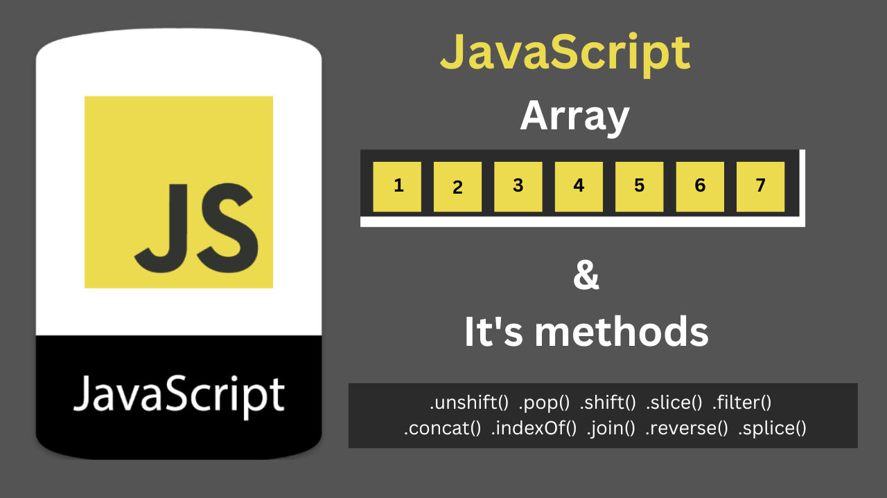

# Array & Array Method



**What is Array ?**

> `An Array is collection of ordered data stored inside a single varibale called as Array. Each items inside an Array is stored in` **Key : Value** `pair Generally denoted as` **Index : Value** `.`

_What an array in JavaScript looks like:_

```javascript
// What an array in JavaScript looks like:

let name = ["Cheese", "Burger", "Pizza"];

let number = [1, 2, 3, 4, 5, 6, 7];
```

**What is index in Array ?**

> `An index in array start from left with 0 in order number `

_What an array in JavaScript looks like:_

```javascript
// Index in Array :

let name = ["Cheese", "Burger", "Pizza"];
console.log[name[0]];
console.log[name[1]];
console.log[name[2]];
```

**Output:**

```
Cheese
Burger
Pizza
```

**Method in JavaScript Array.**

> `Array method are functions built-in to JavaScript that we can apply to our arrays — Each method has a unique function that performs a change or calculation to our array and saves us from writing common functions from scratch.`

> `.unshift()  .pop()  .shift()  .slice()  .filter()  .concat()  .indexOf()  .join()  .reverse()  .splice() & many more`

# .at() method

### _.at(argument) method in array prints the value of argument which in a case of .at() is index_

## Synatx

```javaScript
at(index)
```

````javascript
let arr = [10, 15, 78, 918, 25, 45, 245, 754];

// at()
console.log(
  ` value of index at(4) is : ${arr.at(4)}`
);```
````

**Output:**

```
value of index at(4) is : 25
```

# .concat() method

### _.concat() method is used to merge the two or more array to create new array_

## Synatx

```javaScript
concat(value0)
concat(value0, value1)
concat(value0, value1, valueN)
```

```javascript
let arr = [10, 15, 78];
let arr2 = ["Bread", "Butter", "Cheese"];
let arr3 = ["Pasta", "Pizza", "Burger"];

// Conact()
let concated1 = arr.concat(arr2);
let concated2 = arr.concat(arr2).concat(arr3);

console.log(
  ` Conact Method Adds the number of array after concat() : \n ${concated1} \n ${concated2}}`
);
```

**Output:**

```
Conact Method Adds the number of array after concat() :
10,15,78,Bread,Butter,Cheese
10,15,78,Bread,Butter,Cheese,Pasta,Pizza,Burger}
```

# .fill() method

### _.fill() method changes all elements in an array to a static value, from start index to end index_

## Synatx

```javaScript
fill(value)
fill(value, start)
fill(value, start, end)
```

```javascript
let arr = [10, 11, 12, 13, 14, 15, 16, 17];

// fill
console.log(
  ` fill Method fill the value from start till end of the array : ${arr.fill(
    0,
    4,
    8
  )}}`
);
console.log(
  ` fill Method fill the value from start till end of the array : ${arr.fill(
    3,
    2,
    6
  )}}`
);
```

**Output:**

```
fill Method fill the value from start till end of the array : 10,11,12,13,0,0,0,0}
fill Method fill the value from start till end of the array : 10,11,3,3,3,3,0,0}
```

# .pop() method

### _.pop() removes the last elements of an array and return that elements_

## Synatx

```javaScript
pop()
```

```javascript
let arr = [12, 13, 14, 15, 16, 17, 18];

// pop
console.log(`Pops methods remove the last element in array: ${arr.pop()}`);
console.log(`Pops methods remove the last element in array: ${arr.pop()}`);
```

**Output:**

```
Pops methods remove the last element in array: 18
Pops methods remove the last element in array: 17
```

# .push() method

### _.push() method add one or more element to the end of an array_

## Synatx

```javaScript
push(element0)
push(element0, element1)
push(element0, element1, /* … ,*/ elementN)
```

```javascript
let arr = ["Html", "Css", "Tailwind", "JavaScript", "Jquery"];

// push
let onepush = arr.push("React");
console.log(
  `Push Method add one or more elements at the end of an array \n ${arr} \n `
);

let twopush = arr.push("Angular", "Node.js");
console.log(
  `Push Method add one or more elements at the end of an array \n ${arr} `
);
```

**Output:**

```
Push Method add one or more elements at the end of an array
 Html,Css,Tailwind,JavaScript,Jquery,React

Push Method add one or more elements at the end of an array
 Html,Css,Tailwind,JavaScript,Jquery,React,Angular,Node.js
```

# .reverse() method

### _.reverse() method reverse the order of an array_

## Synatx

```javaScript
reverse()
```

```javascript
let arr = [0, 1, 2, 3, 4, 5, 6];

// Reverse
let newarr = arr.reverse();
console.log(`Reversed array: ${newarr}`);
```

**Output:**

```
Reversed array: 6,5,4,3,2,1,0
```
