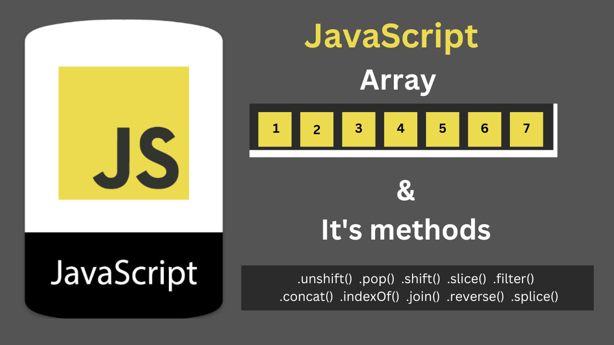

# Array & Array Methods



**What is Array ?**

> `An Array is collection of ordered data stored inside a single varibale called as Array. Each items inside an Array is stored in` **Key : Value** `pair Generally denoted as` **Index : Value** `.`

_What an array in JavaScript looks like:_

```javascript
// What an array in JavaScript looks like:

let name = ["Cheese", "Burger", "Pizza"];

let number = [1, 2, 3, 4, 5, 6, 7];
```

**What is index in Array ?**

> `An index in array start from left with 0 in order number `

_What an array in JavaScript looks like:_

```javascript
// Index in Array :

let name = ["Cheese", "Burger", "Pizza"];
console.log[name[0]];
console.log[name[1]];
console.log[name[2]];
```

**Output:**

```
Cheese
Burger
Pizza
```

**Methods in JavaScript Array.**

> `Array methods are functions built-in to JavaScript that we can apply to our arrays — Each method has a unique function that performs a change or calculation to our array and saves us from writing common functions from scratch.`

> `.unshift()  .pop()  .shift()  .slice()  .filter()  .concat()  .indexOf()  .join()  .reverse()  .splice() & many more`

# .at() method

### _.at(argument) methods in array prints the value of argument which in a case of .at() is index_

## Synatx

```javaScript
at(index)
```

````javascript
let arr = [10, 15, 78, 918, 25, 45, 245, 754];

// at()
console.log(
  ` value of index at(4) is : ${arr.at(4)}`
);```
````

**Output:**

```
value of index at(4) is : 25
```

# .concat() method

### _.concat() methods is used to merge the two or more array to create new array_

## Synatx

```javaScript
concat(value0)
concat(value0, value1)
concat(value0, value1, valueN)
```

````javascript
let arr = [10, 15, 78];
let arr2 = ["Bread", "Butter", "Cheese"];
let arr3 = ["Pasta", "Pizza", "Burger"];

// Conact()
let concated1 = arr.concat(arr2);
let concated2 = arr.concat(arr2).concat(arr3);

console.log(
  ` Conact Methods Adds the number of array after concat() : \n ${concated1} \n ${concated2}}`
);```
````

**Output:**

```
Conact Methods Adds the number of array after concat() :
10,15,78,Bread,Butter,Cheese
10,15,78,Bread,Butter,Cheese,Pasta,Pizza,Burger}
```
